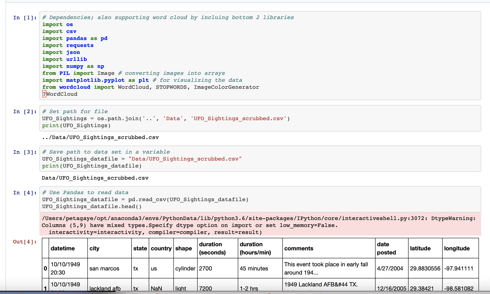
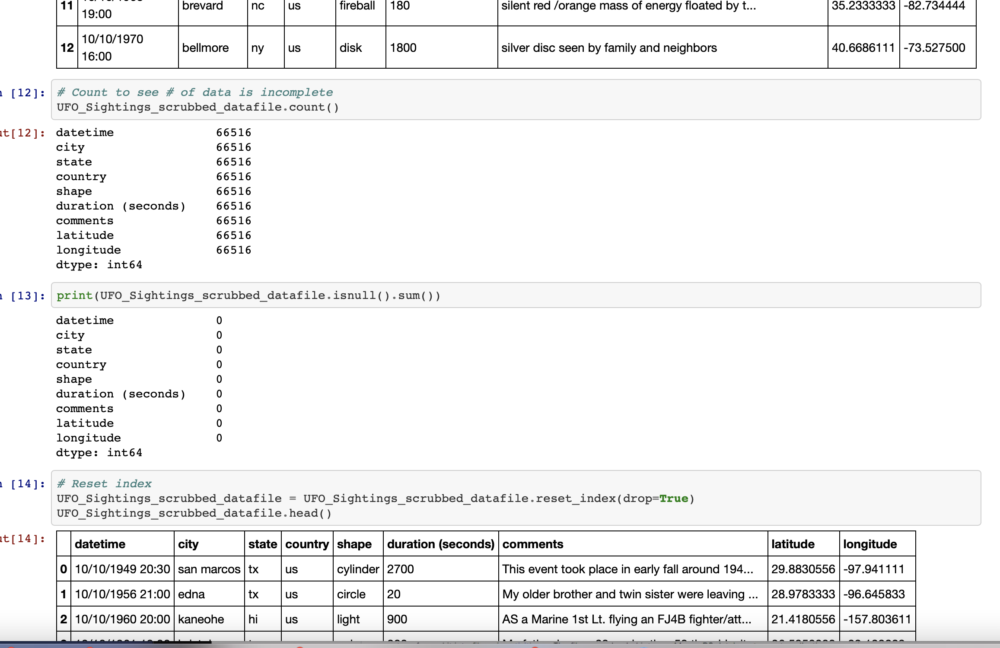
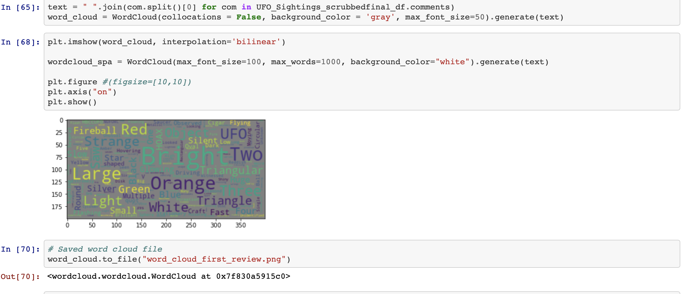
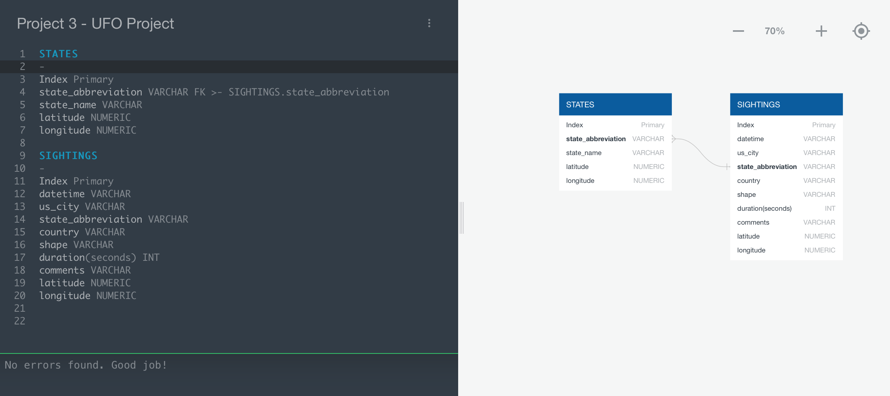

# Where the Wild Things Are - Out of This World?

## **Background**

In order to demonstrate our skills acquired for data cleaning and coding, we created a website to help show where UFO sightings have occurred around the United States.

## **Table of Contents**

- [Data Cleaning](#data-cleaning)
- [Sources](#sources)
- [Status](#status)
- [YouTube Video](#youtube-video)
- [Team Members](#team-members)

## Data Cleaning

- The team obtained data pertaining to UFO sightings in the form of a `csv file` and performed some cleaning activities on it using `jupyter notebook`.  
- The cleaning steps were as follows:
- Defined dependencies and imported the csv
- Dropped 2 columns that were determined not to be required: "duration (hours/min" and "date posted"
- Reviewed the dataset and discovered there were approximately 10K lines of code out of the 80K+ lines of code that were incomplete/insufficient
- Assessed the feasibility of performing an API call to populate the missing data and reviewed with the instructor
Upon review with the instructor, determined the best path forward would be to drop the incomplete data which brought the data pool down to 66K+
- Reset the index of the dataframe to convert to a `csv file` for use in a relational database

Samples

### Sources

The team reviewed multiple datasets and selected a primary source to work with for the UFO sightings visualizations:

[Kaggle UFO CSV](https://www.kaggle.com/NUFORC/ufo-sightings)

## ERD and Database

The team then created an ERD for the database:

## **Status** 

## CURRENTLY UNDER CONSTRUCTION 

## **YouTube Video**

**YouTube Declassified Navy UFO Video**

## **Team Members**
- [Byron Pineda](https://github.com/byronpineda225)
- [Carlyse Thomas](https://github.com/CLyseT)
- [Felicia Felix](https://github.com/Felicia620)
- [Heather Mott](https://github.com/HeathMo)
- [Peta-Gaye Lysius](https://github.com/petagaye2001)
- [Ryan Flammia](https://github.com/rflammia-py)
