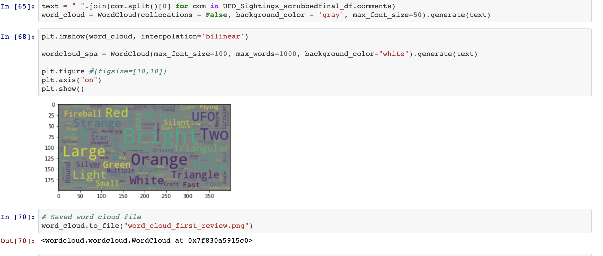

# Where the Wild Things Are - Out of This World?

## **Background**

In order to demonstrate our skills acquired for data cleaning and coding, we created a website to help show where UFO sightings have occurred around the United States.

## **Table of Contents**

- [Data Cleaning](#data-cleaning)
- [Sources](#sources)
- [ERD and SQL Database](#erdandsqldatabase)
- [HTML, CSS, JavaScript, JSON, Flask](#htmlcssjavascriptjsonflask)
- [Heatmap](#heatmap)
- [Troubleshooting](#troubleshooting)
- [Status](#status)
- [YouTube Video](#youtube-video)
- [Team Members](#team-members)
- [Quotes](#quotes)

## Data Cleaning

The team obtained data pertaining to UFO sightings in the form of a `csv file` and performed some cleaning activities on it using `jupyter notebook`.  The cleaning steps were as follows:
1. Defined dependencies and imported the csv, also included Word cloud dependencies to showcase word map as another visulization goal
2. Dropped 2 columns that were determined not to be required: "duration (hours/min)" and "date posted"
3. Reviewed the dataset and discovered there were approximately 10K lines of code out of the 80K+ lines of code that were incomplete/insufficient
4. Assessed the feasibility of performing an API call to populate the missing data and reviewed with the instructor
5. Upon review with the instructor, determined the best path forward would be to drop the incomplete data which brought the data pool down to 66K+
6. Reset the index of the dataframe to convert to a `csv file` for use in a relational database

## **Sample 1**

## **Sample 2**

## **BSample 3 **

### Sources

The team reviewed multiple datasets and selected a primary source to work with for the UFO sightings visualizations:

[Kaggle UFO CSV](https://www.kaggle.com/NUFORC/ufo-sightings)

## ERD and SQL Database

The team then created an ERD for the database:

Using PostgreSQL, several queries were created:

1. Sightings per country
2. Top 20 states in the US with the most sightings
3. Top 5 shapes per country
4. Top 20 provinces outside the US with the most sightings
5. Sightings per decade
6. Total global sightings per month

## HTML, CSS, JavaScript, JSON, Flask

The team created multiple `html` files to create webpages to visualize the queries as well as a heatmap relative to UFO sightings.

*Image of files in VS Code

Pages included are:
- Home page
- Heatmap
- Global information
- United States specific information
- Miscellaneous information

## Heatmap

Using Leaflet, a map with markers and a heatmap was created to show locations of UFO sightings.  Refer to images below.

NOTE: The team learned that the 66+K data points were too many to actually run and so an assessment was completed to balance the abundance of data and the viewer experience.  The end result was to use 1500 sightings to map.

## Troubleshooting

- This project was the first opportunity for the team to render data from a PostgreSQL database. We learned we needed to use a different syntax to achieve this.
- We learned the criticality of folder structure and the effects it can have on our code functioning and website display.
- In order for our code to run properly, we learned that we needed the latest version of the d3 script in the HTML file. 

## **Status** 

## CURRENTLY UNDER CONSTRUCTION 

## **YouTube Video**

**YouTube Declassified Navy UFO Video**

## **Team Members**
- [Byron Pineda](https://github.com/byronpineda225)
- [Carlyse Thomas](https://github.com/CLyseT)
- [Felicia Felix](https://github.com/Felicia620)
- [Heather Mott](https://github.com/HeathMo)
- [Peta-Gaye Lysius](https://github.com/petagaye2001)
- [Ryan Flammia](https://github.com/rflammia-py)

## Quotes
- 'Stare and compare'
- 'Latest and greatest'
